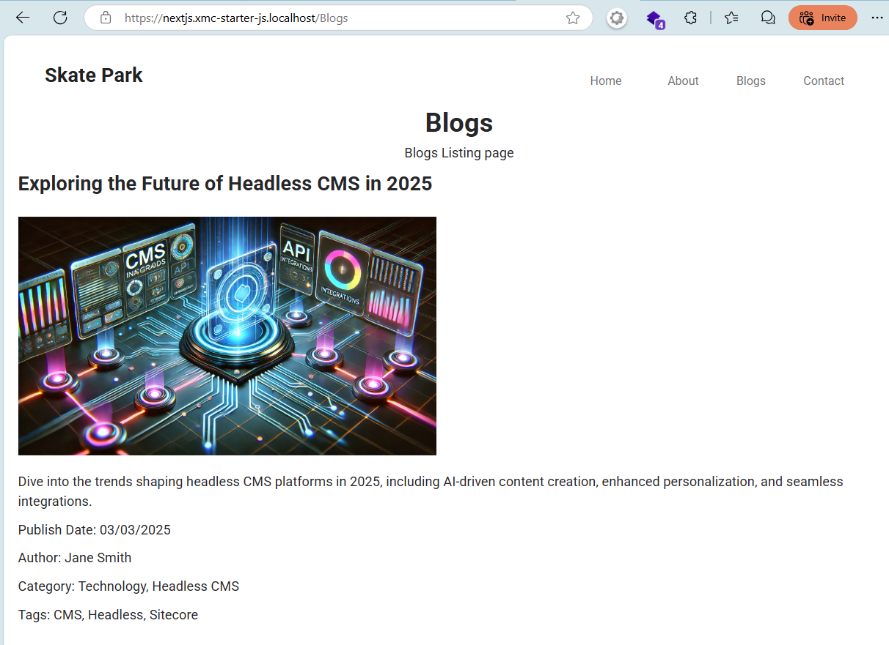

# XM Cloud Front End Application Starter Kits + Blogs with GraphQL

This repository contains the Next.js Starter Kit, and the SPA Starters monorepo (which includes a Node Proxy Application and and SPA starter apps) for Sitecore XM Cloud Development. It is intended to get developers up and running quickly with a new front end project that is integrated with Sitecore XM Cloud.

## GitHub Template

This Github repository is a template that can be used to create your own repository. To get started, click the `Use this template` button at the top of the repository.

### Prerequisites

- Access to an Sitecore XM Cloud Environment
- [Node.js LTS](https://nodejs.org/en/)

### Getting Started Guide

For developers new to XM Cloud you can follow the Getting Started Guide on the [Sitecore Documentation Site](https://doc.sitecore.com/xmc) to get up and running with XM Cloud. This will walk you through the process of creating a new XM Cloud Project, provisioning an Environment, deploying the NextJs Starter Kit, and finally creating your first Component.

### Running the Next.js Starter Kit

- Log into the Sitecore XM Cloud Deploy Portal, locate your Environment and select the `Developer Settings` tab.
- Ensure that the `Preview` toggle is enabled.
- In the `Local Development` section, click to copy the sample `.env` file contents to your clipboard.
- Create a new `.env.local` file in the `./headapps/nextjs-starter` folder of this repository and paste the contents from your clipboard.
- Run the following commands in the root of the repository to start the NextJs application:
  ```bash
  cd headapps/nextjs-starter
  npm install
  npm run start:connected
  ```
- You should now be able to access your site on `http://localhost:3000` and see your changes in real-time as you make them.

### SPA Starters Monorepo and Angular SPA

A new starter SPA based on Angular has been introduced with JSS v22.3.0. The Angular starter has been designed to be compatible with XM Cloud and should be used with the provided node XM Cloud proxy application to handle server-side rendering (SSR), data queries, personalization and more. For more details and information on how to run and deploy the Angular starter and proxy to XM Cloud have a look at [SPA starters monorepo](headapps/spa-starters/)

## Disconnected offline development

It is possible to mock a small subset of the XM Cloud Application elements to enable offline development. This can allow for a disconnected development experience, however it is recommend to work in the default connected mode.

You can find more information about how setup the offline development experience [here](./local-containers/README.md)
